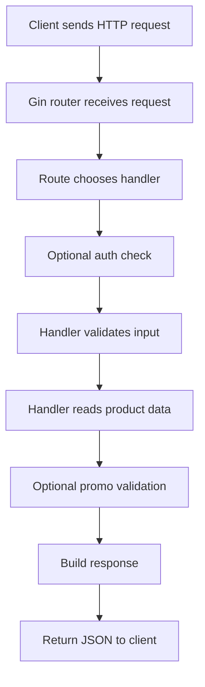
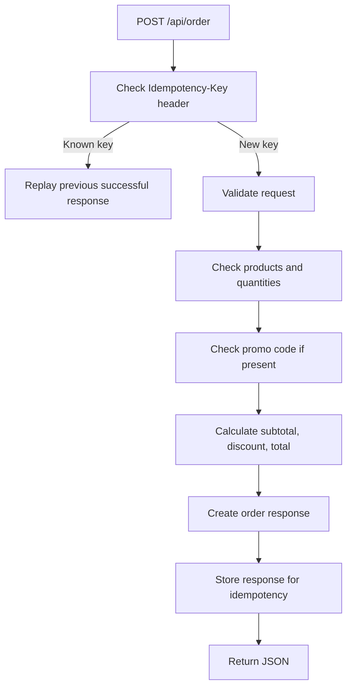
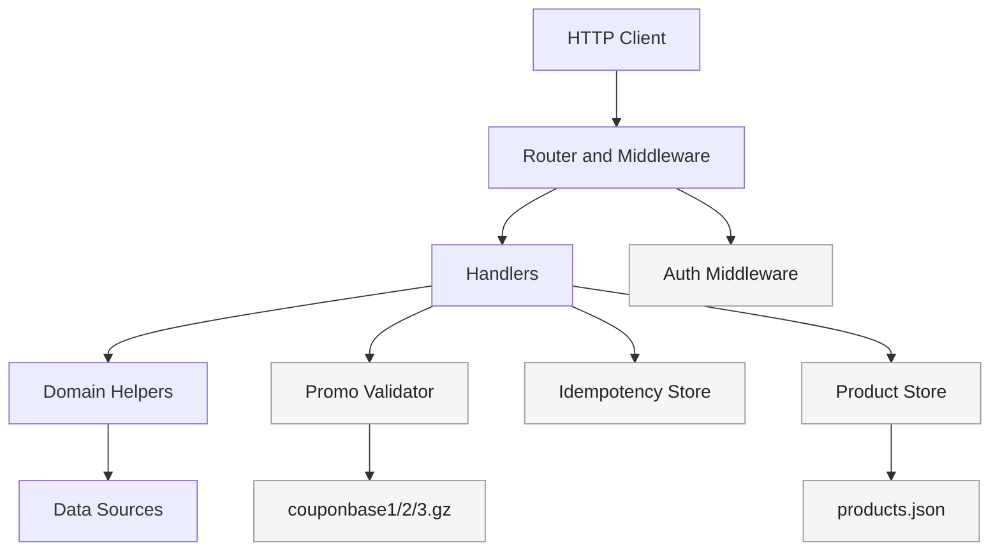
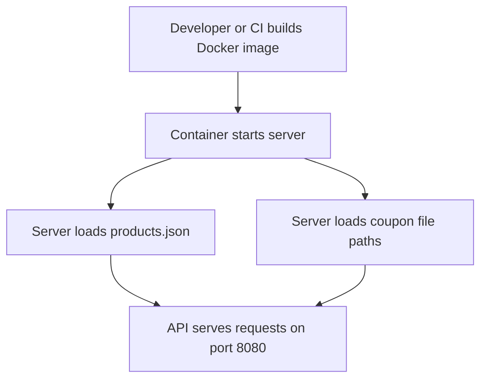

# Backend Architecture Guide

This document explains what this backend does, how it is organized, and why certain design decisions were made.

It is written for two audiences at the same time:

- reviewers who want to understand the technical structure
- non-technical readers who want a clear picture of how the system works

## 1. What This Project Does

This project is a small backend service for a food ordering app.

In simple terms, it does three main jobs:

1. It shows the list of products that can be ordered.
2. It shows details for one product.
3. It accepts an order, validates it, checks an optional promo code, and returns the final order result.

The API is exposed under the `/api` path.

Current endpoints:

- `GET /api/product`
- `GET /api/product/{productId}`
- `POST /api/order`

## 2. A Simple Mental Model

You can think of this backend as a small restaurant counter system:

- the product store is the menu board
- the auth layer checks whether a request is allowed
- the order handler is the cashier
- the promo validator is the coupon checker
- the idempotency store remembers if the same order was already processed

## 3. High-Level Flow

Here is the main request flow:

For order creation, there is an extra idempotency step:

## 4. Architecture Overview

The project uses a simple layered design.

This is intentionally a lightweight architecture because the challenge is small. Even so, the code is separated enough that future growth is still practical.

## 5. Folder-by-Folder Explanation

### `cmd/server`

This is the application entrypoint.

File:

- [cmd/server/main.go](/C:/Users/dines/OneDrive/Desktop/coding/backendchallenge/oolio-backend-challenge#/cmd/server/main.go)

Responsibilities:

- load configuration
- load products
- initialize coupon validator
- initialize auth and idempotency helpers
- register routes
- start the HTTP server

Why this matters:

- keeping the startup wiring in one place makes the rest of the code easier to understand
- this is the place where the whole application is assembled

### `internal/config`

File:

- [internal/config/config.go](/C:/Users/dines/OneDrive/Desktop/coding/backendchallenge/oolio-backend-challenge#/internal/config/config.go)

Responsibilities:

- read environment variables
- apply defaults
- resolve file paths

Why this matters:

- configuration is centralized
- changing deployment settings does not require code changes

In plain language:

- this is the control panel for the app

### `internal/handlers`

Files:

- [internal/handlers/handlers.go](/C:/Users/dines/OneDrive/Desktop/coding/backendchallenge/oolio-backend-challenge#/internal/handlers/handlers.go)
- [internal/handlers/product.go](/C:/Users/dines/OneDrive/Desktop/coding/backendchallenge/oolio-backend-challenge#/internal/handlers/product.go)
- [internal/handlers/order.go](/C:/Users/dines/OneDrive/Desktop/coding/backendchallenge/oolio-backend-challenge#/internal/handlers/order.go)

Responsibilities:

- receive requests
- validate inputs
- call supporting components
- return JSON responses

Why this matters:

- handlers are the bridge between the outside world and the business logic

In plain language:

- handlers are the front desk staff of the API

### `internal/store`

File:

- [internal/store/products.go](/C:/Users/dines/OneDrive/Desktop/coding/backendchallenge/oolio-backend-challenge#/internal/store/products.go)

Responsibilities:

- load product data from `data/products.json`
- keep products in memory
- support list and lookup operations

Why this matters:

- product reads are fast after startup
- the rest of the application does not need to know how products were loaded

In plain language:

- this is the app's internal product catalog

### `internal/promo`

Files:

- [internal/promo/promo.go](/C:/Users/dines/OneDrive/Desktop/coding/backendchallenge/oolio-backend-challenge#/internal/promo/promo.go)
- [internal/promo/promo_test.go](/C:/Users/dines/OneDrive/Desktop/coding/backendchallenge/oolio-backend-challenge#/internal/promo/promo_test.go)

Responsibilities:

- validate promo codes
- stream gzip files instead of loading huge files fully into memory
- cache previous results

Why this matters:

- coupon validation is the most interesting performance part of the challenge
- this avoids expensive startup time
- repeated coupon checks become faster

In plain language:

- this is the coupon detective

### `internal/middleware`

File:

- [internal/middleware/auth.go](/C:/Users/dines/OneDrive/Desktop/coding/backendchallenge/oolio-backend-challenge#/internal/middleware/auth.go)

Responsibilities:

- read the `api_key` header
- verify that the key exists
- verify required scope for order creation

Why this matters:

- security checks should happen before order logic runs

In plain language:

- this is the security guard at the door

### `internal/idempotency`

File:

- [internal/idempotency/store.go](/C:/Users/dines/OneDrive/Desktop/coding/backendchallenge/oolio-backend-challenge#/internal/idempotency/store.go)

Responsibilities:

- remember successful order responses by idempotency key
- replay the same response for duplicate retries

Why this matters:

- clients often retry network calls
- idempotency helps prevent accidental duplicate processing

In plain language:

- this is the memory that says, "we already handled this exact request"

### `internal/models`

File:

- [internal/models/models.go](/C:/Users/dines/OneDrive/Desktop/coding/backendchallenge/oolio-backend-challenge#/internal/models/models.go)

Responsibilities:

- define request and response shapes
- keep shared data structures in one place

Why this matters:

- clean data models reduce duplication and confusion

## 6. Request Lifecycle in Detail

### Product listing

When the client asks for all products:

1. Request reaches `GET /api/product`
2. Router sends it to the product handler
3. Handler asks the product store for all loaded products
4. Server returns JSON

This is very fast because products are already loaded in memory.

### Product lookup

When the client asks for one product:

1. Request reaches `GET /api/product/{productId}`
2. Handler validates the path ID
3. Store looks up the product
4. If found, return `200`
5. If invalid, return `400`
6. If missing, return `404`

### Order creation

Order creation is the richest flow in the app:

1. Request reaches `POST /api/order`
2. Auth middleware checks `api_key`
3. Handler checks whether an `Idempotency-Key` already exists
4. If the same key was already processed successfully, return the saved response
5. Otherwise, parse the JSON body
6. Validate items are present
7. Validate each product ID and quantity
8. Calculate subtotal
9. If a coupon is provided, validate it
10. Calculate discount and final total
11. Generate a new order ID
12. Build the response JSON
13. Save the response for idempotency replay if needed
14. Return the order

## 7. Design Decisions and Why They Were Chosen

### Decision 1: Keep products in memory

Why:

- product data is small
- reads are frequent
- it simplifies the challenge implementation

Benefit:

- fast lookups
- easy implementation

Tradeoff:

- updates require restart or a different storage design

### Decision 2: Stream coupon files instead of preloading everything

Why:

- coupon corpora can be large
- startup cost matters
- memory usage matters

Benefit:

- low startup memory pressure
- works with large files

Tradeoff:

- the first request for a new coupon can be slower

### Decision 3: Cache coupon validation results

Why:

- the same coupon may be used more than once
- repeated scans would be wasteful

Benefit:

- repeated validations become much faster

Tradeoff:

- cache is only in memory, so it resets on restart

### Decision 4: Use idempotency for successful order requests

Why:

- clients retry requests when networks are unstable
- duplicate retries should not create confusion

Benefit:

- safer client experience
- more realistic API behavior

Tradeoff:

- current idempotency storage is local to one process only

### Decision 5: Use environment-based configuration

Why:

- the same code should run locally, in Docker, and in hosted environments

Benefit:

- flexible deployment
- easier testing and operations

## 8. Data Structure and Algorithm Choices

This project uses simple but appropriate data structure choices.

### Product store

Data structures used:

- slice for ordered product listing
- map for fast lookup by ID

Why this is good:

- listing preserves the original order
- lookup by ID is efficient

### Idempotency store

Data structures used:

- map keyed by idempotency key
- read/write mutex for safe concurrent access

Why this is good:

- fast lookup
- safe for multiple simultaneous requests

### Promo validation

Algorithm approach:

- read each gzip file in chunks
- keep a small overlap window between chunks
- stop early once the code is found in 2 files

Why this is good:

- avoids loading entire large files into memory
- correctly handles matches that cross chunk boundaries
- avoids unnecessary extra work once validity is already proven

## 9. Non-Technical Explanation of the Coupon Logic

Imagine three very large books filled with random letters.

A coupon is considered valid only if:

- its length looks correct
- it is made of letters and numbers
- the same coupon text appears somewhere inside at least two of those books

Instead of reading and storing all three books in memory before the app starts, the system reads through them in parts only when needed. That makes startup lighter and more practical for large files.

## 10. Scalability Discussion

This solution is good for a challenge or small service, but it also shows a path toward larger real-world usage.

### What already scales reasonably well

- product reads are fast
- coupon validation avoids loading huge files into memory
- read-heavy operations are straightforward

### What does not yet scale to large production use

- orders are not stored permanently
- idempotency cache is not shared between app instances
- coupon cache is local to one server instance
- there are no metrics, tracing, rate limits, or health probes yet

### How to scale it further

1. Move orders into a database.
2. Move idempotency storage to Redis or a database.
3. Use shared caching if many instances run behind a load balancer.
4. Add observability tools such as metrics and tracing.
5. Consider pre-indexing coupons if coupon traffic becomes very high.

## 11. Extensibility Discussion

The code is intentionally small, but it can grow.

Good extension points:

- product storage can move from JSON to a database-backed repository
- auth can grow from simple API keys to JWT or OAuth
- coupon validation can move to a dedicated service or indexed search
- order processing can add persistence, events, payment, or inventory logic

This is easier because responsibilities are already separated into focused packages.

## 12. Error Handling Philosophy

The server returns clear HTTP status codes and JSON error responses.

Examples:

- `400` for malformed requests
- `401` for missing or invalid API keys
- `403` for valid key but missing scope
- `404` for missing products
- `422` for business validation errors such as invalid coupon or bad quantity

Why this matters:

- clients can understand what went wrong
- reviewers can see the difference between syntax errors and business-rule failures

## 13. Testing Strategy

The project includes tests for the most important parts:

- product listing and lookup
- auth behavior
- successful order creation
- coupon validation
- idempotency behavior

Why this matters:

- the most important paths are protected against regressions

## 14. Deployment View

The repository now includes Docker support.

Deployment idea:

This makes local review and deployment easier because the app can run in a predictable packaged environment.

## 15. Known Gaps

A few intentional or current limitations still exist:

- product responses do not yet include the live demo's `image` object
- orders are returned but not persisted
- idempotency is in-memory only
- no database or external cache is used yet

These are reasonable tradeoffs for a challenge submission, but they are documented so reviewers can clearly see what would come next.

## 16. Final Summary

In simple terms:

- this backend is a clean, modular Go service
- it implements the required API endpoints
- it uses a thoughtful coupon-validation approach for large files
- it adds auth, idempotency, tests, and Docker support
- it is small enough to understand quickly but organized enough to grow further

If a non-technical person wants the shortest summary:

- this system shows products, accepts orders, checks discount codes carefully, and is organized so it can be improved into a more production-ready service over time
